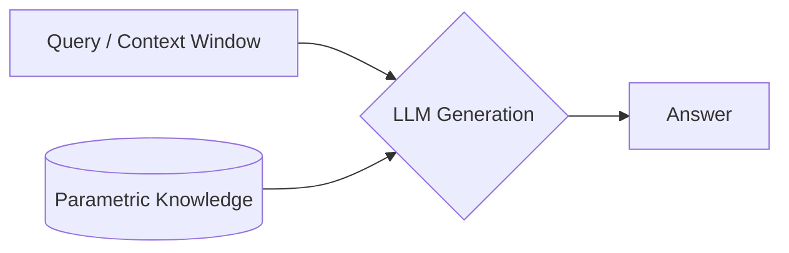
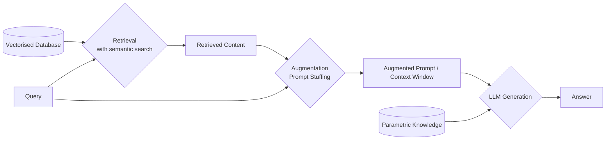
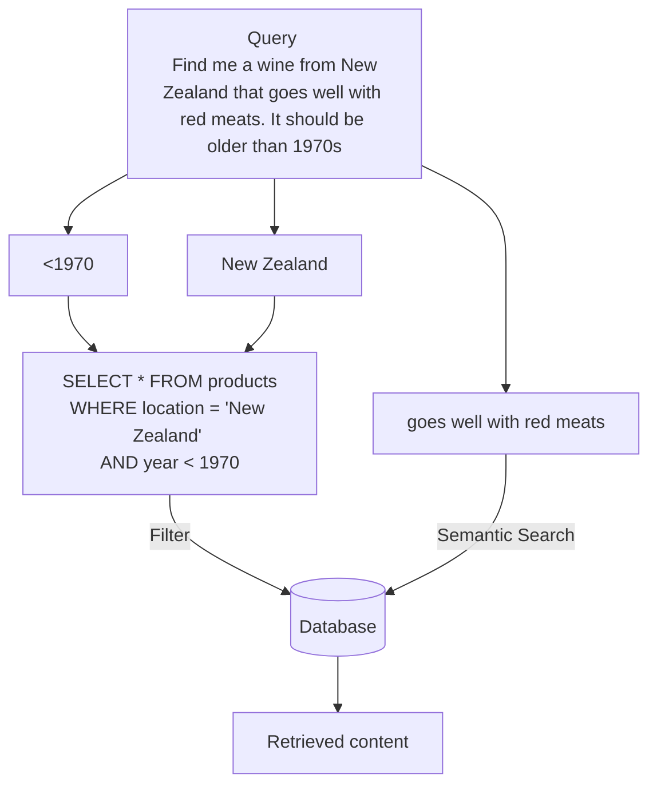
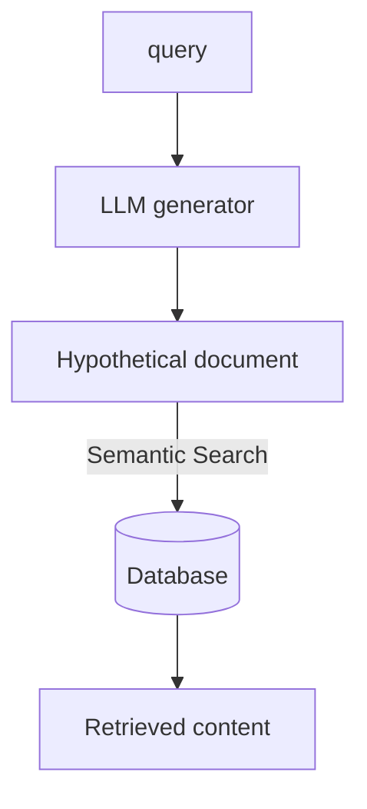

# Advanced RAG Discussion


## Introduction

Large language models have two main sources of information. 

* Parametric knowledge: This is all the information that the model was trained on. LLMs are generally good at using this knowledge to synthesise language, but bad at retrieving specific facts from within it. 

* Context window: This is where you write your prompt. In the case of chat based LLMs like Chat GPT, your previous conversation is also considered in the context window. LLMs are generally much better at retrieving facts that are given in the context window. 




## Basic RAG

RAG introduces a third source of information, a database. 
A RAG pipeline retrieves the most relevant information to the query from the database, then puts it into the context window. 

There are advantages to storing and retrieving knowledge in this way. 

* Easy to keep up to date (Parametric knowledge is only as new as the most recent training)
* Easy to delete (forgetting parametric knowledge is hard)
* LLMs can quote sources for their generated content
* LLMs can say "I don't know" when it can't source a relevant fact to form its answer. 


Generally in basic RAG retrieval is done using semantic search. 
The database and the query are vectorised using a semantic embedder (encoding the meaning of the sentence). 


Semantic search for RAG involves finding relevant content by understanding the context of a query, not just specific words. It retrieves information based on meaning, making search results more accurate and insightful for RAG applications.


## Advanced RAG

The basic idea of RAG has been expanded on, incorporating numerous techniques to improve the generated output. 

Many techniques improve the retrieval element specifically, and lots of these ideas are not new. Optimising search results is a well established and documented problem. 

### Retrieval

Chunk Optimisation:


There are situations where keyword or numerical filters would be more effective than semantic search. 
When you use an online shop, you'll often use natural language to describe the item you want, but then use filters to narrow down the search space. 
Self Querying retrieval uses and LLM to extract keywords from the query that can be used to filter down the database. 

Self Querying retrieval: 




HyDE

Semantic search compares a query against the documents in the database.  
But sometimes the documents being searched through are in a very different form to the queries asked.

Hypothetical Document Embeddings or HyDE attempts to bridge this gap by doing a document to document semantic comparison.  
An LLM uses the query to produce a hypothetical document in the same form that they are found in the database.  
This hypothetical document is then used as the starting point for the semantic search.


This technique requires an LLM to produce a potential document, from which the answer to the question could be drawn, and then use that as a semantic tool.
Other techniques get the LLM to try and answer the question without context, and then use that answer to improve the generation or retrieval. 

Retrieval can also be improved through fine tuning of the embedder models. 
A specialised embedder, fine tuned on the kind of documents or questions expected in the task, can produce a much more precise vector space and improve retrieval results. 


### Augmentation
Once the materials have been retrieved, the original query can be augmented with extra context. 
LLMs perform quite differently depending on how the prompt is worded. Increasingly the task of prompt engineering is being automated and tackled by LLMs themselves. 

Re-Rank
We know that LLMs are better at retrieving facts from context. More specifically, they have been found to be better at retrieving facts from the start and end of context. 
One of the simpler re-rank ideas is to place the most relevant retrieved materials at the start and end of the augmented prompt. 


### Generation

Getting the generation right is the ultimate goal of the RAG pipeline, and all other parts can be evaluated by the performance of the generated content. 
Once the query has been augmented, an LLM will attempt to generate an answer. This is another area where fine tuning can be utilised. 

Often RAG is pitted against fine tuning, but this is with respect to the models ability to retrieve facts, rather than the abilty to generate good answers. 
Both techniques can be used together, with a vectorised database being the main, updatable knowledge store, and the generator being fine tuned for the task. The fine tuning is then not so much that the model will be tuned on the right knowledge, but that it will be familiar with the right form of language expected in the output. 


## Modular RAG

```mermaid

```

## Agents
